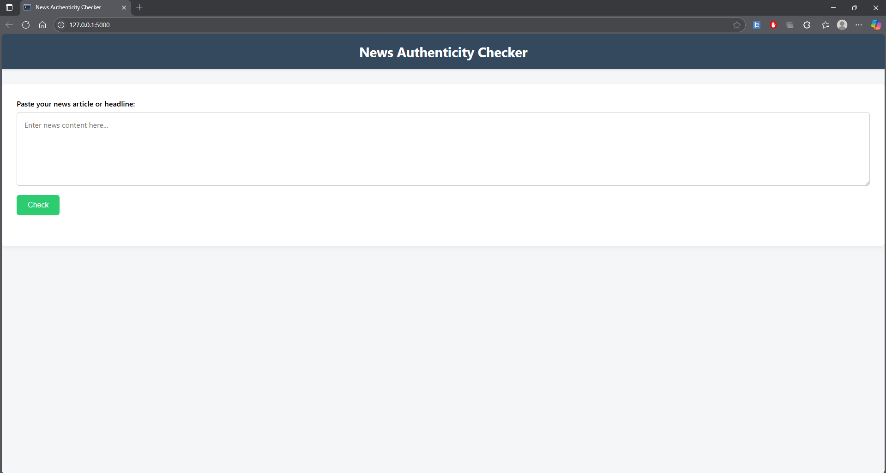
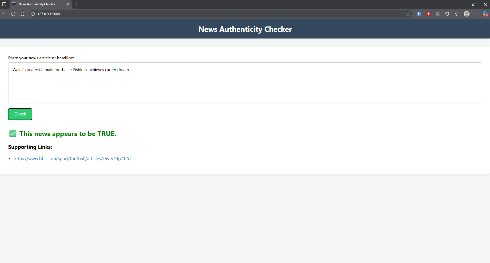
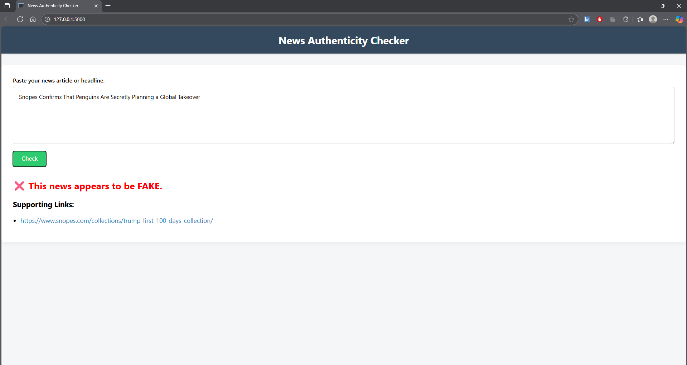

# News Authenticity Checker

A simple Flask web application that helps users check the authenticity of news articles or headlines. The app uses the Google Custom Search API to find related news and fact-checking sources, then provides a verdict (TRUE, FAKE, or REVIEW NEEDED) based on the credibility of the sources found.

---

## Project Directory Structure

```
news-checker-app/
├── static/
│   └── style.css
├── templates/
│   └── index.html
├── news_checker.py
├── requirements.txt
├── README.md
└── snapshots/
    ├── home.png
    ├── verdict_true.png
    ├── verdict_fake.png
    └── verdict_review.png
```

- **static/**: Contains static files like CSS.
- **templates/**: Contains HTML templates for Flask.
- **news_checker.py**: Main Flask application.
- **requirements.txt**: Python dependencies.
- **snapshots/**: Screenshots of the frontend for demonstration.

---

## Setup Instructions

1. **Clone the repository:**
   ```sh
   git clone <repository-url>
   cd news-checker-app
   ```

2. **Create a virtual environment:**
   ```sh
   python -m venv venv
   ```

3. **Activate the virtual environment:**
   - On Windows:
     ```sh
     venv\Scripts\activate
     ```
   - On macOS/Linux:
     ```sh
     source venv/bin/activate
     ```

4. **Install dependencies:**
   ```sh
   pip install -r requirements.txt
   ```

5. **Set up your Google Custom Search API:**
   - Go to [Google Cloud Console](https://console.cloud.google.com/).
   - Enable the Custom Search API and generate an API key.
   - Go to [Google Custom Search Engine](https://cse.google.com/cse/all) and create a new search engine.
   - Note your Search Engine ID (cx).
   - Replace the placeholder values for `API_KEY` and `SEARCH_ENGINE_ID` in `news_checker.py` with your credentials.

---

## Usage

1. **Run the application:**
   ```sh
   python news_checker.py
   ```

2. **Open your browser and go to:**
   ```
   http://127.0.0.1:5000
   ```

3. **Paste or type a news article or headline** in the form and click "Check".

4. **View the verdict and supporting links** to help you verify the news.

---

## Snapshots

### Home Page



### Example: TRUE Verdict



### Example: FAKE Verdict



---

## How It Works

- The app takes your input and uses the first 50 words as a search query.
- It queries Google Custom Search for related articles.
- It checks if the results are from trusted news or fact-checking sites.
- Based on the sources, it classifies the news as TRUE, FAKE, or prompts you to review the links.

---

## Customization

- **Trusted and fact-checking sites** can be edited in `news_checker.py` in the `classify_based_on_results` function.
- **Number of links shown** can be changed by modifying the slice in the API response.

---

## Contributing

Contributions, bug reports, and feature requests are welcome!  
Please open an issue or submit a pull request.

---

## License

This project is licensed under the MIT License. See the [LICENSE](LICENSE) file for details.

---

## Acknowledgments

- [Flask](https://flask.palletsprojects.com/)
- [Google Custom Search API](https://developers.google.com/custom-search/v1/overview)